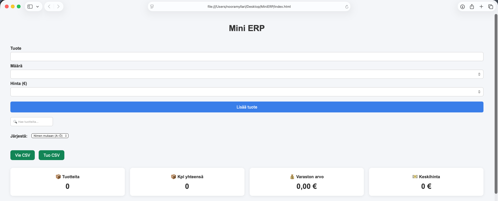
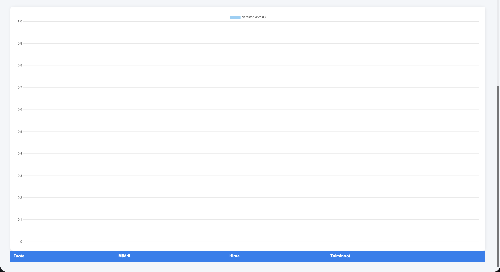
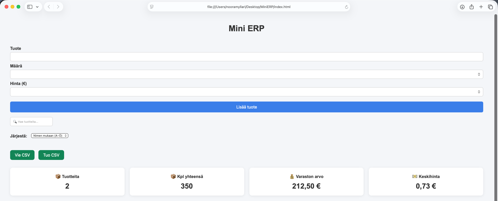
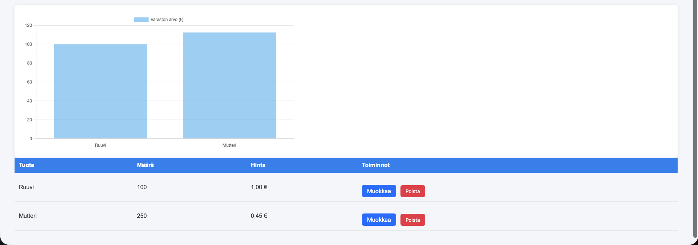

# Mini ERP

Yksinkertainen selainpohjainen varastonhallintasovellus, jonka toteutin web-kehityksen osaamiseni kehittämiseksi.

## Ominaisuudet

- Tuotteiden lisääminen
- Tuotteiden muokkaaminen
- Tuotteiden poistaminen
- Hakutoiminto
- Lajittelu
- Dashboard
- Kaavio
- LocalStorage-tallennus
- CSV-tuonti ja -vienti
- Responsiivinen käyttöliittymä.

## Teknologiat

- HTML
- CSS
- JavaScript
- Chart.js
- LocalStorage API

## Kehitysympäristö

- Visual Studio Code
- Git
- GitHub

## Oppimistavoitteet

- Web-kehityksen harjoittelu
- Gitin opettelu
- GitHubin opettelu
- Portfolioprojektin toteuttaminen

## Kuvakaappauksia

### Etusivu

### Tuotteet lisätty

### Kaavio ja luettelo

